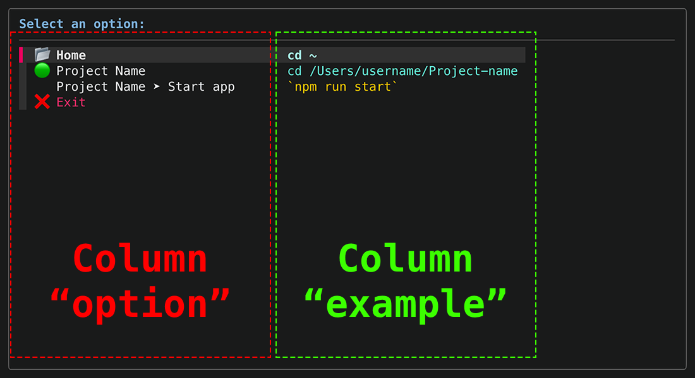

# Interactive Menu

Interactive `fzf`-based menu for **Zsh** terminals. You can choose an option using the arrow keys, select items with the mouse and filter the available options that match the given term.

This guide provides the necessary steps to install and run the interactive menu.


## Prerequisites

### Zsh

Zsh should be installed on your system. Most macOS versions come with Zsh pre-installed. To set it as your default shell, use:

```
chsh -s /bin/zsh
```

### Homebrew

Install Homebrew if it's not already installed. Homebrew is a package manager for macOS.

```
/bin/bash -c "$(curl -fsSL https://raw.githubusercontent.com/Homebrew/install/HEAD/install.sh)"
```

## Required Packages

The script requires **jq** and **fzf** to be installed. Use **Homebrew** to install these packages.

### jq

**jq** is a lightweight and flexible command-line JSON processor.

```
brew install jq
```

### fzf

**fzf** is a command-line fuzzy finder.

```
brew install fzf
```

## Configuration

### Menu Script (`menu.zsh`)

Ensure the script is saved with executable permissions:

```sh
chmod +x menu.zsh
```

### Configuration File (`menu.json`)

Copy the `menu.sample.json` file and save it as `menu.json`. This is the file used to create the menu.

One of the commands present in the `menu.sample.json` file is `"Exit"`. We recommend that you keep this command in the `menu.json` file, but it is not mandatory.



Each item in this file has the following structure (some properties are optional, we will highlight them below):

```json
{
  "option": "Project Name ➤ Start app",
  "example": "`npm run start`",
  "commands": [
    "cd /Users/username/Project-name",
    "npm run start"
  ],
  "colors": {
    "example": "yellow"
  },
  "padding": {
    "option": 1
  }
}
```

<table style="width: 100%">
  <tr>
    <th>Property</th>
    <th>Description</th>
  </tr>
  <tr>
    <td style="white-space: nowrap"><code>"option"</code></td>
    <td>
      This is the content that will be displayed in the <code>"option"</code> column (left column).
    </td>
  </tr>
  <tr>
    <td style="white-space: nowrap"><code>"example"</code></td>
    <td>
      This is the content that will be displayed in the <code>"example"</code> column (right column). This column is
      normally used to display which command will be executed. Even if there is more than one command to be executed, we
      show in this column what the main action is, normally the last action that will be executed.
    </td>
  </tr>
  <tr>
    <td style="white-space: nowrap"><code>"commands"</code></td>
    <td>
      Array with all the actions that need to be executed, according to the sequence in which they were declared. For
      example, to execute a command within a specific project, we first need to access the project folder and then
      execute the desired command.
    </td>
  </tr>
  <tr>
    <td style="white-space: nowrap"><code>"colors"</code></td>
    <td>
      <strong><em>Optional</em></strong>. If we want to change the color of a certain column, we can use the
      <code>"colors"</code> property, which is an object, and the properties of this object are the names of the
      available columns (at the moment, there are two: <code>"option"</code> and <code>"example"</code>). If you do not
      want to change the color, this property can be omitted from the JSON.
      <br>
      <br>
      Colors available:
      <code>"black"</code>, <code>"red"</code>, <code>"green"</code>, <code>"yellow"</code>, <code>"blue"</code>,
      <code>"magenta"</code>, <code>"cyan"</code>, <code>"white"</code>
    </td>
  </tr>
  <tr>
    <td style="white-space: nowrap"><code>"padding"</code></td>
    <td>
      <strong><em>Optional</em></strong>. If we want to change the padding on the right side of a given column, we can
      use the <code>"padding"</code> property, which is also an object like the <code>"colors"</code> property, and the
      properties of this object are the names of the available columns (at the moment, there are two:
      <code>"option"</code> and <code>"example"</code>). If you do not want to change the padding, this property can be
      omitted from the JSON.
      <br>
      <br>
      This property is useful when we use emojis, especially in the <code>"option"</code> column in one of the menu
      options. The width of the menu columns is based on the size of the texts that will be rendered, but emojis usually
      have more <em>bytes</em> than a common letter and the functions that calculate the size of a string cannot
      identify the presence of emojis. To compensate, we use this property and visually adjust a column if necessary.
      <br>
      <br>
      Padding is usually applied to a column that <strong>does not</strong> use emojis.
    </td>
  </tr>
</table>


## Using the menu

The easiest way to use this menu is to create an _alias_, so the menu can be called from any directory.

Aliases can be stored in the `~/.zshrc` file or in any other "dotfile" you want. If you choose the second, don't forget to link it to the `.zshrc` file. For example, if you use a file called `.aliases` and it is in the same folder as the `.zshrc` file:

```sh
source ~/.aliases
```

Store the alias in the desired file:

```sh
alias menu='source absolute/path/to/the/file/menu.zsh'
```

That's it! Now you can access the menu by typing `menu` in the terminal regardless of the current directory.
